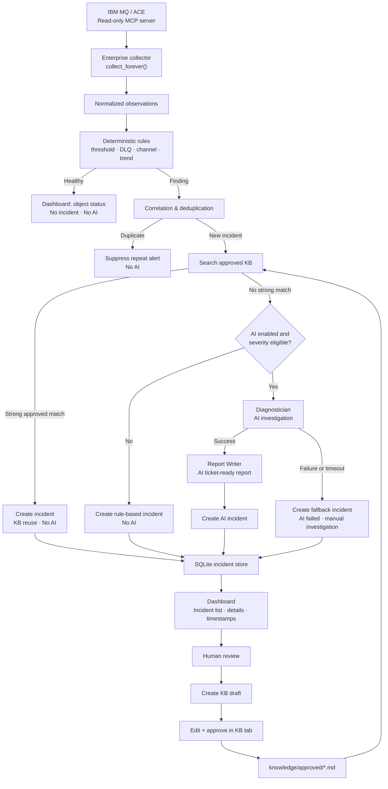

# End-to-end incident workflow

The collector and rule engine always run without AI. AI is conditional on a
new, eligible incident without a strong approved knowledge-base match. Any AI
failure still creates a visible fallback incident for manual investigation.
