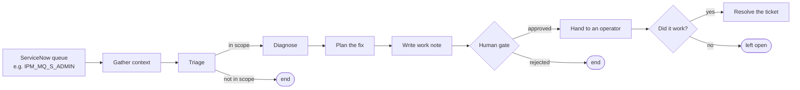
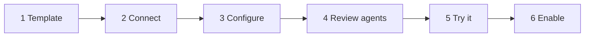

# SignalOps — user manual

How to go from a fresh install to a workflow that watches a ServiceNow queue,
diagnoses incidents and proposes fixes for a human to approve.

Read time: about ten minutes. Setup time: about the same.

> **A note on the pictures.** The diagrams below are drawn from the actual
> screens — the same labels, the same buttons, in the same order. They are
> diagrams rather than screenshots, so if a caption and the app ever disagree,
> the app is right and this file needs updating.

---

## Contents

1. [What SignalOps does](#1-what-signalops-does)
2. [First run — signing in as the administrator](#2-first-run--signing-in-as-the-administrator)
3. [Adding a ServiceNow connection](#3-adding-a-servicenow-connection)
4. [Creating a workflow](#4-creating-a-workflow)
5. [Reviewing and customising the agents](#5-reviewing-and-customising-the-agents)
6. [Trying it once without writing anything](#6-trying-it-once-without-writing-anything)
7. [Turning it on](#7-turning-it-on)
8. [Living with it: runs and approvals](#8-living-with-it-runs-and-approvals)
9. [Downloading your workflow as a Python app](#9-downloading-your-workflow-as-a-python-app)
10. [Users and roles](#10-users-and-roles)
11. [Stopping everything](#11-stopping-everything)
12. [Troubleshooting](#12-troubleshooting)

---

## 1. What SignalOps does

You point it at a ServiceNow queue. When an incident lands there, it gathers
the context around it, works out what probably caused it, writes a proposed
remediation into the ticket, and **stops and asks you** before anything else
happens.



Two things it will **never** do on its own: execute a remediation, or resolve a
ticket nobody confirmed was fixed. It proposes; people act.

There is a second workflow, **Ticket → pull request**, which finds the relevant
code, assesses how risky the change is, writes it on a branch, runs your test
suite and opens a draft PR. Same principle: it never merges, and a failing test
suite blocks the PR regardless of what the review agent thinks.

---

## 2. First run — signing in as the administrator

The administrator is **configuration, not data**. Set it where the server runs,
in `.env`:

```bash
SIGNALOPS_ADMIN_EMAIL=admin@yourcompany.com
SIGNALOPS_ADMIN_PASSWORD=a-long-password-you-choose
```

Start the server and open <http://localhost:8000>.

```
┌──────────────────────────────────────────────┐
│  ◆ SignalOps                                 │
│                                              │
│  Email     [ admin@yourcompany.com       ]   │
│  Password  [ ••••••••••••••••            ]   │
│                                              │
│                [ Sign in ]                   │
└──────────────────────────────────────────────┘
```

That is the whole login screen. **There is no sign-up, and no first-run form**,
because there is no unauthenticated way to create an account at all — an
endpoint that could create the first administrator is one that whoever reaches
a fresh instance first can use to claim it. An account that can only be
established by someone with access to the server's environment cannot be
claimed over the network.

Everyone else is created by this administrator from the **Users** screen — see
[section 10](#10-users-and-roles).

### Three consequences worth knowing

- **The environment wins on every start.** The admin's password, role and
  active flag are re-applied at boot. Changing that password in the UI will not
  survive a restart; change it in `.env` instead.
- **That is also the recovery path.** Locked out, or someone deactivated the
  admin? Edit `.env`, restart, and you are back in. No database surgery.
- **The server refuses to start** if no administrator is configured and none
  exists. Serving a login screen nobody could get past is a worse failure than
  not starting, because it looks like the app is working.

---

## 3. Adding a ServiceNow connection

Go to **Connections** in the sidebar, then **Add ServiceNow connection**.

One connection is one ServiceNow instance with one account and one queue. Add
as many as you need — a dev instance and a production instance are simply two
connections, and each workflow names the one it uses.

| Field | What to put in it |
|---|---|
| **Connection name** | Whatever you will recognise later: `Production`, `Dev 385636`. |
| **Instance URL** | `https://dev385636.service-now.com` |
| **Authentication** | `Basic` unless your instance requires OAuth. |
| **Username / Password** | A dedicated integration account, not a person's login. |
| **Client ID / secret** | OAuth only. From *System OAuth → Application Registry*. |
| **Monitored queue** | The assignment group, e.g. `IPM_MQ_S_ADMIN`. New active incidents here trigger the workflow. |
| **Extra filter** | Optional ServiceNow encoded query, e.g. `priority<=2`, combined with the queue. |

> ### ⚠ The one setting that catches everyone
>
> In ServiceNow, open the integration user's record and set **identity type to
> `Machine`**. ServiceNow refuses HTTP Basic for the REST API from accounts
> typed as `Human`, and the error it returns is *identical* to a wrong
> password — the same 401 you get for a user that does not exist. The account
> will sign in fine at the ServiceNow login page while every API call fails.
>
> If you would rather not change it, use OAuth instead. Both are supported.

Press **Save**, then **Test connection**. A good result looks like:

```
[connected] Connected using basic authentication.
            Queue 'IPM_MQ_S_ADMIN' currently matches 3 active incident(s).
```

That second sentence is the useful one: it proves the queue name is right, not
just the password.

### About your credentials

They are encrypted before being written to the database, and no screen or API
endpoint can read them back — the app can tell you a password *is set*, never
what it is. Leaving the password field blank when editing keeps the stored one,
so changing a queue name does not mean retyping a secret.

Being exact about the limit: the encryption key lives on the same machine as
the database. That protects against a stolen database file or a stray backup.
It does not protect against someone who can read both files.

Set `SIGNALOPS_SECRET_KEY` to supply the key yourself — from a vault, a KMS, or
your orchestrator's secret injection — and the platform never writes a key to
disk at all. Moving custody to a dedicated secret manager is the intended
destination; the environment variable is the seam it plugs into.

---

## 4. Creating a workflow

Go to **Workflows**. On a fresh workspace the setup wizard *is* the page.



### Step 1 — Template

Two cards. Each states plainly what the workflow touches, what it will do
unattended, and what it will never do unattended. Read the third line; that is
the one you are actually agreeing to.

Pick **Incident remediation**, give it a name, and continue.

### Step 2 — Connect

Choose the ServiceNow connection you made in section 3. If you skipped that,
you can create it here and come back.

### Step 3 — Configure

| Setting | Meaning |
|---|---|
| **Connection** | Which ServiceNow instance and queue this workflow watches. |
| **Poll every** | How often to check the queue. Minimum 30 seconds; 120 is a sensible default. |
| **Budget per run** | A hard stop, not a warning. A run that reaches it is cancelled. |
| **Dry run** | On by default. Work notes are composed and recorded but never sent. |
| **Ask for an outcome report** | On means the ticket is only resolved when someone confirms the fix worked. Off means the run ends at hand-off and the ticket is left open. |

---

## 5. Reviewing and customising the agents

### Step 4 of the wizard — see what will run

Every agent that can touch your tickets is listed, with the model it uses and
how far it can reach. Nothing else runs. There are no hidden actors.

For incident remediation:

| Agent | What it decides | Reach |
|---|---|---|
| **Triage** | Is this ticket in scope, and how urgent | read |
| **Diagnostician** | Root cause, evidence, and a confidence score | read |
| **Remediation planner** | The concrete steps a human would take | read |

### Customising an agent

Go to **Agents** in the sidebar (Configure group) and press **Edit** on any of
them. You can change:

- **Model** — `haiku` for cheap and fast, `sonnet` for balance, `opus` for the
  hardest reasoning.
- **Instructions** — the agent's whole task prompt. Rewrite it freely for your
  environment; there is a link to restore the shipped version.
- **Extra guidance** — added below the instructions, for shaping judgement:
  *"Treat queue depth above 8000 as urgent."*
- **Confidence gate** — below this, the run always asks a human.
- **Always require approval** — on for anything whose output drives an action.
- **Enabled** — optional agents can be switched off; the form tells you exactly
  what you lose.

**What you cannot change, by design:** the tools an agent may use and its risk
tier. Those live in code and have no setting anywhere, so customisation changes
how an agent *judges*, never what it can *reach*. The safety rules at the top of
every prompt are likewise not editable — your instructions are added below them.

Press **Save**. Changes apply to the next run and are recorded in **Audit**.

---

## 6. Trying it once without writing anything

### Step 5 of the wizard

Optional, and worth doing. Paste an incident (a sample is pre-filled, or use a
real one) and press **Start the test run**.

You will see each step complete, then the work note it *would* have posted:

```
enrich       succeeded    gathered=[recent_changes]  source=servicenow
triage       succeeded
diagnose     succeeded
plan         succeeded
work_note    succeeded    sent=False  characters=525

[dry run passed] The work note below was composed and NOT sent.
```

If `enrich` shows `gathered=[]`, the incident simply had no recent changes or
past incidents around it. The run records that rather than hiding it, so a
hedged diagnosis is explained by thin evidence instead of looking like a weak
agent.

---

## 7. Turning it on

### Step 6 of the wizard

Tick **Poll ServiceNow automatically** if you want it to watch the queue on its
own, then press **Enable workflow**.

If you skipped the test run you can still enable — you will get a warning
saying you are about to see the output for the first time on a real ticket. The
protections that matter are still in place: dry run is the default mode, and
every run stops at a human gate.

From here, any new active incident in your monitored queue starts a run.

---

## 8. Living with it: runs and approvals

### Runs

Every step is recorded as it happens, so a run that fails part way is still
legible afterwards rather than a gap. Press **Timeline** on any run to see each
node, how long it took, what it cost, and what it produced.

Runs survive a restart. A run paused at an approval will still be there
tomorrow.

### Approvals

```
┌────────────────────────────────────────────────────────┐
│ INC0012345 — 3 step plan, risk low.        [simulated] │
│ Paused because this agent is configured to always ask. │
│                                                        │
│ Cause: SYSTEM.ADMIN.SVRCONN blocked by the 08:55       │
│        firewall change (86% confident)                 │
│                                                        │
│  1. Restore the previous firewall rule for QM1         │
│     verify: channel status returns to RUNNING          │
│     rollback: re-apply the new rule                    │
│                                                        │
│ Pinned to 7dc6ad49e3da…                                │
│                                                        │
│           [ Approve ]   [ Reject ]                     │
└────────────────────────────────────────────────────────┘
```

That **Pinned to** line matters. Your approval is bound to a hash of the exact
plan you were shown. If the plan changes afterwards, the decision does not carry
over and you are asked again — approving a plan can never silently authorise a
different one.

If the workflow asks for outcome reports, it stops a second time after you
approve, with different buttons: **It worked** / **It did not resolve it**. Only
"It worked" resolves the ticket. Approving a plan and having run it are
different facts, and only the second can justify closing an incident.

---

## 9. Downloading your workflow as a Python app

On any workflow card, press **Download standalone app**. You get a zip
containing the whole thing:

```
signalops-incident-remediation/
├── README.md            setup: venv, requirements, key, Docker
├── workflow.py          the graph, the model calls, the CLI
├── schemas.py           output validation
├── agents/
│   ├── triage.md              ← your customisations included
│   ├── diagnostician.md
│   └── remediation-planner.md
├── agents_config.json
├── sample_ticket.json
├── requirements.txt
├── Dockerfile
└── .env.example
```

### Running it with a virtual environment

```bash
python3 -m venv .venv
source .venv/bin/activate          # Windows: .venv\Scripts\Activate.ps1
python -m pip install -r requirements.txt
cp .env.example .env               # then put your ANTHROPIC_API_KEY in it
python workflow.py sample_ticket.json
```

### Running it with Docker

```bash
docker build -t signalops-workflow .
docker run --rm -it -e ANTHROPIC_API_KEY="$ANTHROPIC_API_KEY" \
  -v "$PWD/checkpoints:/app/checkpoints" signalops-workflow sample_ticket.json
```

`-it` matters: the workflow pauses for approval and needs a terminal to ask.
`-v` keeps the checkpoint database outside the container so a paused run
survives the container exiting.

### What does not come with it

The README says this in full, and it is the honest part of a lift-and-shift:
the exported app has **no audit trail, no roles, no tier enforcement, no
budget, no kill switch and no ticketing integration**. The workflow logic is
faithful; the governance around it is not, and that gap is most of what a
platform is for. Use it to run the workflow somewhere the platform cannot go,
or to read exactly what the agents are asked — not as a drop-in replacement for
a governed deployment.

Agents can also be downloaded individually from the **Agents** page, in the
Claude subagent format, ready to drop into any project's `.claude/agents/`
directory.

---

## 10. Users and roles

**Users** in the sidebar. Press **Invite user**, set an email, a name, a role
and an initial password. They will be asked to change it when they first sign
in, since you know the one you chose.

The administrator from `.env` appears in this list like anyone else, but is
re-asserted from the environment at every start — so demoting or deactivating
it in the UI is temporary. Promote a second admin here if you want one that the
environment does not own.

| Role | Can |
|---|---|
| **Viewer** | See everything. Change nothing. |
| **Operator** | Start runs, test connections. |
| **Approver** | Decide on human gates. |
| **Admin** | Agents, connections, users, workflows, the kill switch. |

Roles are enforced by the server on every request. Hiding a button is
presentation; the check is behind it.

Two guards you will meet: you cannot remove your own admin access or deactivate
yourself, and the last active admin cannot be demoted. Both are recoverable only
by editing the database by hand.

Users are deactivated rather than deleted, because deleting one would orphan
the audit entries and approvals that name them. Deactivation takes effect on the
user's next request, not their next login.

---

## 11. Stopping everything

The **kill switch** is in the header, admin only. It halts every run in this
workspace — including ones already in flight, which stop at their next step —
and refuses to start new ones. Turning it off does not resurrect cancelled runs;
work somebody stopped stays stopped.

Individual workflows can be disabled from their card, and a single run can be
cancelled from its timeline.

---

## 12. Troubleshooting

### "401 User is not authenticated" when testing a connection

In order of likelihood:

1. **The user's identity type is `Human`.** Set it to `Machine`. This is the
   usual cause and nothing in the error mentions it.
2. **The account has MFA enabled.** Basic auth cannot satisfy a second factor.
3. **The instance refuses basic auth for REST entirely.** Switch that
   connection to OAuth.

A 401 is *not* proof the password is wrong — ServiceNow returns the identical
response for a user that does not exist. If the same account signs in at
`/login.do`, the password is fine and one of the three above is the cause.

### "403" when testing a connection

Different problem entirely. The credential was accepted; the account lacks a
role for that table. Grant it read on `incident` and, if you want work notes,
write.

### "No administrator exists and none is configured"

The server will not start. Set `SIGNALOPS_ADMIN_EMAIL` and
`SIGNALOPS_ADMIN_PASSWORD` in `.env` (at least 10 characters) and restart.

### Every result says "simulated"

There is no `ANTHROPIC_API_KEY` set, so the platform runs a simulated model and
labels every result. The whole workflow runs and nothing is fabricated as real.
Add a key and restart.

### The queue matches nothing

Press **Test connection** — it reports how many active incidents the queue
currently matches. If that is zero, check the assignment group name against
ServiceNow exactly, including case.

### A run says "blocked"

Workflow B only: your repository's test suite failed, so no pull request was
opened. That is deliberate and cannot be overridden from here — a failing suite
blocks the PR regardless of what the review agent concluded.

---

## Where things are recorded

**Audit** shows every login, agent change, connection change, workflow change,
approval and external write, with who did it and when. While the platform can
verify identity it says so; entries made under any unverified provider are
marked as claims rather than facts.
